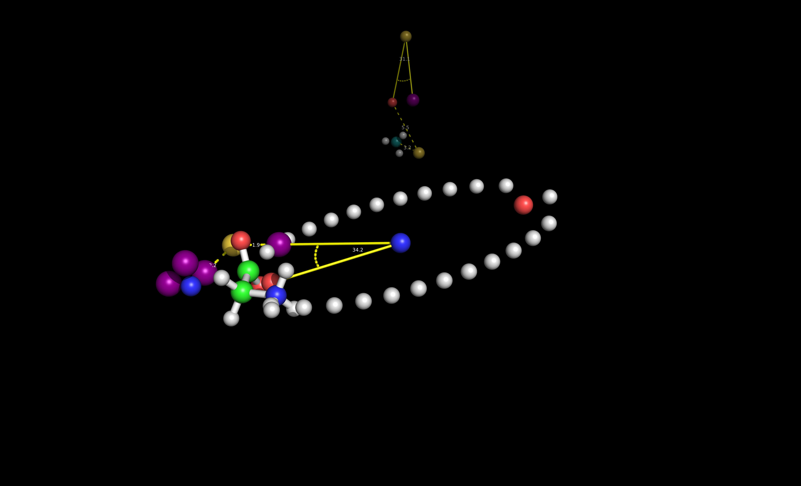

# MolecularTetris
*De novo* cyclic protein polypeptide design using reinforcement learning.

<p align="center"></p>

## Description:
This is an environment designed to be compatible with OpenAI's gymnasium (not gym) library and optimised for Python 3.10+ that builds a cyclic protein polypeptide molecule. The goal is to build a cyclic polypeptide molecule, one amino acid at a time, going around an elliptical path, while hitting specific targets.

## How to use:
Install the depedencies using this command:

```
pip install numpy scipy gymnasium git+https://github.com/sarisabban/Pose
```

The output of the environment play are two .pdb (protein databank) files called *molecule.pdb* and *path.pdb*. These files can be viewed using PyMOL `apt install pymol`, or any other molecular visualisation software, or you can upload these structures [here](https://www.rcsb.org/3d-view) and view the files on a web browser.

To play by code (standard gymnasium setup):

```
from MolecularTetris import MolecularTetris

env = MolecularTetris(render_mode='human')

observation_space = env.observation_space
action_space = env.action_space
metadata = env.metadata
render_mode = env.render_mode
reward_range = env.reward_range

observation, info = env.reset(seed=0)
actions = env.action_space.sample()
observation, reward, terminated, truncated, info = env.step(actions)

```
A step adds an amino acid and rotates its Φ and Ψ torsion angles as such env.step([AMINO ACID, PHI, PSI]).

You can use `env.render(show=False, save=True)` to save rather than show the environment output, must have PyMOL installed to display the output. If no output is displayed, i.e PyMOL does not automatically open then go to the environment's directory, open the *pyvenv.cfg* and change the line *include-system-site-packages = false* to be true (all small letters).

The **actions** are as follows:
| Action   | Name | Values                   |
|----------|------|--------------------------|
|Amino Acid|AA    |Canonical and non-canonical D-amino acids and L-amino acids (52 actions)|
|Phi angle |P     |0-359 angles (360 actions)|
|Psi angle |S     |0-359 angles (360 actions)|

The **features** are as follows:
| Feature                             | Name    | Values   | Description           |
|-------------------------------------|---------|----------|-----------------------|
|Eccentricity                         |e        |[0, 1]    |Eccentricity of the ellipse|
|Index of step                        |i        |[0, 15]   |The index of the state step|
|Odd/Even of step                     |OE       |[0, 1]    |Whether the step is even or odd value|
|Angle of Cα                          |T        |[0, 360]  |The angle of the latest Cα atom from the start position through the centre of the ellipse|
|Distance of Cα                       |d        |[-50, 50] |The distance of the Cα atom from the surface of the ellipse|
|Switch                               |Switch   |[0, 1]    |The point where the chain switchs from moving away from the start position the returning|
|Φ angle for lowest angle T           |Ta-Φ     |[0, 7]    |The phi action that will result in the greatest leap forward (most reduced angle)|
|Ψ angle for lowest angle T           |Ta-Ψ     |[0, 7]    |The psi action that will result in the greatest leap forward (most reduced angle)|
|Expected future angle T              |fT       |[0, 360]  |The predicted angle that will result if the recommended phi and psi actions were taken|
|Φ angle for lowest distance          |da-Φ     |[0, 7]    |The phi action that will result in the least distance to the ellipse surface|
|Ψ angle for lowest distance          |da-Ψ     |[0, 7]    |The psi action that will result in the least distance to the ellipse surface|
|Expected future distance mag         |fd       |[-50, 50] |The predicted distance that will result if the recommended phi and psi actions were taken|
|Φ angle for lowest distance to target|ft-Φ     |[0, 7]    |The phi action that will result in the least sidechain distance to the target|
|Ψ angle for lowest distance to target|ft-Ψ     |[0, 7]    |The psi action that will result in the least sidechain distance to the target|
|Expected future distance to target   |ft       |[0, 13]   |The predicted distance to target that will result if the recommended phi and psi actions were taken|
|Distance to C-term                   |C-term   |[0, 1000] |The distance from N-term to C-term (for loop closure)|
|Targets                              |Trgs     |[3, 10]   |The number of reminaing targets|
|Direction of target                  |direction|[0, 1]    |0 if target is away from side chain, 1 if target is in the same direction as the side chain|
|Distance to target                   |Ca_t     |[0, 13]   |Distabce from Cα to target|

The **rewards** are as follows:
| Reward                        | Name | Values                           | Description           |
|-------------------------------|------|----------------------------------|-----------------------|
|Forward/Backward move          |R1    |(-1/14)*i + (15/14) or -1         |When current Cα angle is less than previous angle (moving forward) + reward (diminishes 1->0 with increasing molecule size) else -1 reward|
|Cα Distance                    |R2    |-0.1*distance<sup>2</sup>         |Cα distance from ellipse surface (more negative further away)|
|Cα outside/inside ellipse      |R3    |±1                                |If the Cα is outside the ellipse +1 rewards|
|Moving clockwise/anti-clockwise|R4    |±1                                |If the Cα if moving away from the start poisition before the switch and towards the start position after the switch|
|Target rewards                 |Rr    |(-9/29)*SS_size + (299/29) hit or -10 miss or -1 wrong AA or 0 far|If the agent hits a target + reward (diminishes 10->1 with increasing sidechain size), if failed to hit target because it chose the wrong amino acid -1 penalty, if it passed the target without hitting -10 penalty, if the target is too far away 0 reward|
|Pre-mature end                 |Rt    |i - N                             |If the peptide chain makes a circle around itself the environment will end and a penalty is given, larger the chain the less the penalty|
|Loop closure                   |Rtc   |n / N                             |If N-term to C-term distance < 1.5 Å the environment will end and a reward is given, shorter polypeptide give larger reward|

The **stop conditions** are as follows:
| Condition                     | Name | Values | Description           |
|-------------------------------|------|--------|-----------------------|
|Polypeptide length of i=N      |St1   |0       |The polypeptide can only reach a maximum length of N amino acids|
|Self circle                    |St2   |Rt      |If the peptide chain makes a circle around itself the environment will end and a penalty is given, larger the chain the less the penalty|
|Loop closure                   |St3   |Rtc     |If the N-term to C-term distance < 1.5 Å|

> __Note__
> 
> **i**: is the current index of the amino acid.
> 
> **n**: is the current final size of the built polypeptide.
> 
> **N**: is largest possible size of a polypeptide allowed by the environment (20 amino acids).

## Training:
Provided is the `RL.py` script that trains on the environment or plays an already trained enviroment. Instructions are isolated within the script itself, since this training process is separate from the actual environment code.
